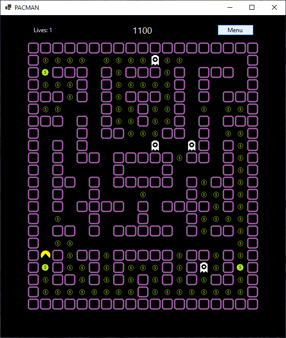

# Pacman

This is my own implementation of the popular game Pacman. It was put together under the worflow of Windows Forms and it is advisable to open under [Visual Studio](https://visualstudio.microsoft.com/) which supports it. Except for some design elements and movement of the ghosts (which was inspired by the game but is not the same), the program is near identical copy of the original.

---

